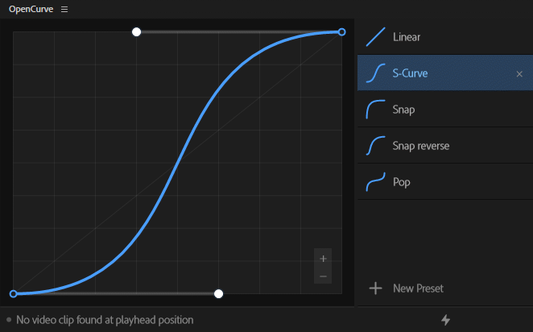
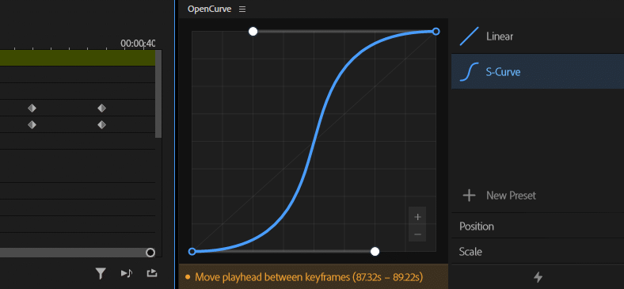

  

A free bezier curve editor plugin to add custom easing to your keyframes in Adobe Premiere Pro.

---

---

### How it works
Place your playhead between 2 keyframes, select a property (position, opacity, scale, etc.), and apply your curve. OpenCurve writes the bezier handles directly to your keyframes.

---

### Features
- **Works anywhere** — Use directly on clips, on the Transform effect, on Adjustment Layers, etc
- **Presets** — Save any curve as a named preset and share them easily
- **Snap to grid** — Hold shift to snap the bezier handles to the grid
- **Undo and redo** — Supports Premiere's history system for full redo/undo support
- **Spell Book support** — Fully supports Spell Book, allowing keyboard shortcuts
- **Themes** — Change the colour of the graph line and control points to suit your workspace
- **Update notifications** — Get notified inside the plugin when a new version is available

---

### Installation

1. Download the [latest release](https://github.com/fayewave/OpenCurve/releases/latest)
2. Double-click the `.ccx` file
3. Creative Cloud will prompt you to confirm — click **Install**
4. Open Premiere Pro and find OpenCurve under **Window → Extensions**

---

### Requirements

- Adobe Premiere Pro 2024 or later

---

