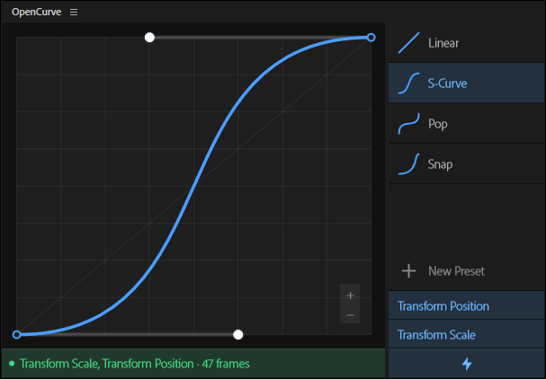

# OpenCurve

A bezier curve editor to add custom easing to your keyframes in Premiere Pro.

No purchases. No bloatware. Free forever.

---

---

## How it works
Place your playhead between 2 keyframes, select a property (position, opacity, scale, etc.), and apply your curve. OpenCurve writes the bezier handles directly to your keyframes - no manual handle dragging in the timeline required.

### Features
- **Works anywhere** — Use it directly on clips, on the Transform effect, on Adjustment Layers, anywhere you need it.
- **Presets** — Save any curve as a named preset with a single click. Presets are persistent across sessions and can be reordered by drag.
- **Snap to grid** — Hold shift to snap the bezier handles to the grid.
- **Custom curve colour** — change the colour of the graph line and control points to suit your workspace.
- **Update notifications** — get notified inside the plugin when a new version is available.

---

## Installation

1. Download the [latest release](https://github.com/fayewave/OpenCurve/releases/latest)
2. Double-click the `.ccx` file
3. Creative Cloud will prompt you to confirm — click **Install**
4. Open Premiere Pro and find OpenCurve under **Window → Extensions**

---

## Requirements

- Adobe Premiere Pro 2024 or later

---
