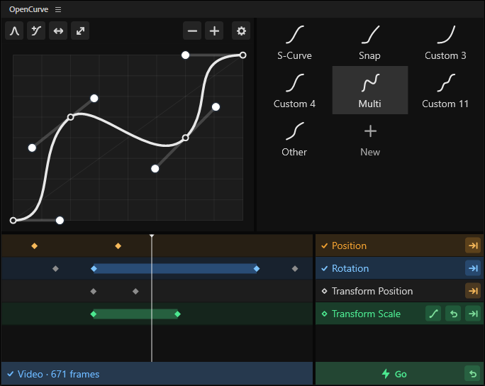
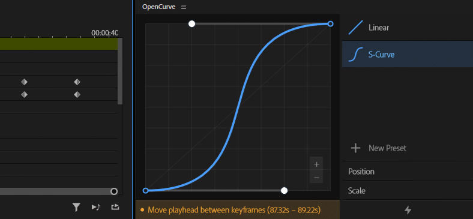

  

A free bezier curve editor plugin to add custom easing to your keyframes in Adobe Premiere Pro.

**Download the** [**latest release.**](https://github.com/fayewave/OpenCurve/releases/latest) 

**Also available on** [**Adobe Exchange.**](https://exchange.adobe.com/apps/cc/3ecc7304/opencurve)

---

---

### How it works
Place your playhead between 2 keyframes, select a property (position, opacity, scale, etc.), and apply your curve. OpenCurve writes the bezier handles directly to your keyframes.

---

### Features
- **Works anywhere** — Use on clips, nests, the Transform effect, Adjustment Layers
- **Auto-detects keyframes** — finds keyframes on clips at the playhead without requiring you to select them first
- **Presets** — Save any curve as a named preset and share them easily
- **Snap to grid** — Hold shift to snap the bezier handles to the grid
- **Flip and invert** — One click turns an ease-in into the matching ease-out, or swaps time and value for the inverse ease
- **Load a baked curve back** — Baked properties remember their curve, even after reopening the project, so you can pick it up again and tweak it
- **Keyframe spacing** — Bake a keyframe every frame for an exact match, or every 2 or 4 frames for a lighter timeline
- **Undo and redo** — Supports Premiere's history system for full undo/redo support (`.ccx` version only)
- **Customization** — List/grid view, change the grid size, and custom themes
- **Free forever** — No bloat, no logins. Made by an actual video editor for the editing community

---

### Installation

#### Premiere 2025 or newer:
1. Download the `.ccx` file in the [latest release](https://github.com/fayewave/OpenCurve/releases/latest)
2. Open the `.ccx` file
3. Creative Cloud will prompt you to confirm — click **Install**
4. Open Premiere Pro and find OpenCurve under **Window → UXP Plugins**

#### Premiere 2024 or older:
1. Download the `.zxp` file in the [latest release](https://github.com/fayewave/OpenCurve/releases/latest)
2. Install the `.zxp` file using [aescripts ZXP Installer](https://aescripts.com/learn/zxp-installer/) (free).
4. Open Premiere Pro and find OpenCurve under **Window → Extensions**
> ⚠️Warning: The `.zxp` version uses a dedicated Undo button (next to Go) instead of Ctrl+Z/Command+Z due to Premiere limitations. If you're using Premiere 2025 or later, I **highly recommend** using the `.ccx` version instead. It's faster and better.

---

### Requirements

- Adobe Premiere 2020+
- Mac & PC compatible

---

