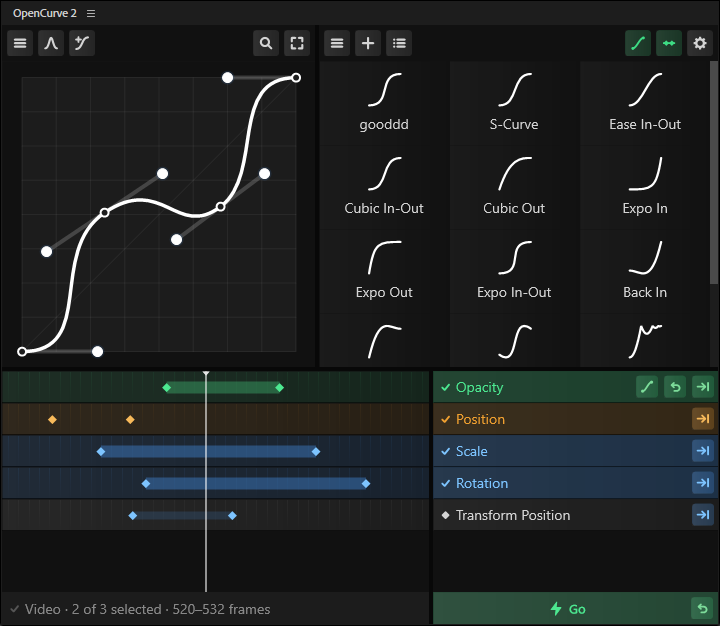

  

A free bezier curve editor plugin to add custom easing to your keyframes in Adobe Premiere Pro.

### [**Download here.**](https://github.com/fayewave/OpenCurve/releases/latest) 
### **Also available on** [**Adobe Exchange.**](https://exchange.adobe.com/apps/cc/3ecc7304/opencurve)

---

---

### How it works
Place your playhead between 2 keyframes, select a property (position, opacity, scale, etc.), and apply your curve. OpenCurve writes the bezier handles directly to your keyframes.

---

### Features
- **Works anywhere** — Use on clips, nests, graphics, the Transform effect and Adjustment Layers
- **Auto-detects keyframes** — Finds keyframes on clips automatically
- **Multi-point curves** — Add points to build complex motion in a single ease, with smooth or broken handles
- **A-curve mode** — Shape the ease as a speed graph: drag the peak to where the motion is fastest
- **Presets** — Save, rename and reorder your curves, and export/import them to share
- **Mini timeline** — See every keyframed property at a glance
- **Per-property undo** — Undo a single property's ease, or load its baked curve back onto the graph, even after reopening the project
- **Undo and redo** — Supports Premiere's history system for full undo/redo support (`.ccx` version only)
- **Customization** — Themes, grid size, list/grid presets, resizable layout, full-screen graph mode, numeric entry, and more
- **Free forever** — No bloat, no logins.

---

### Installation

**Download the** [**latest release.**](https://github.com/fayewave/OpenCurve/releases/latest) 

---

### Requirements

- Adobe Premiere 2020+
- Mac & PC compatible

---
